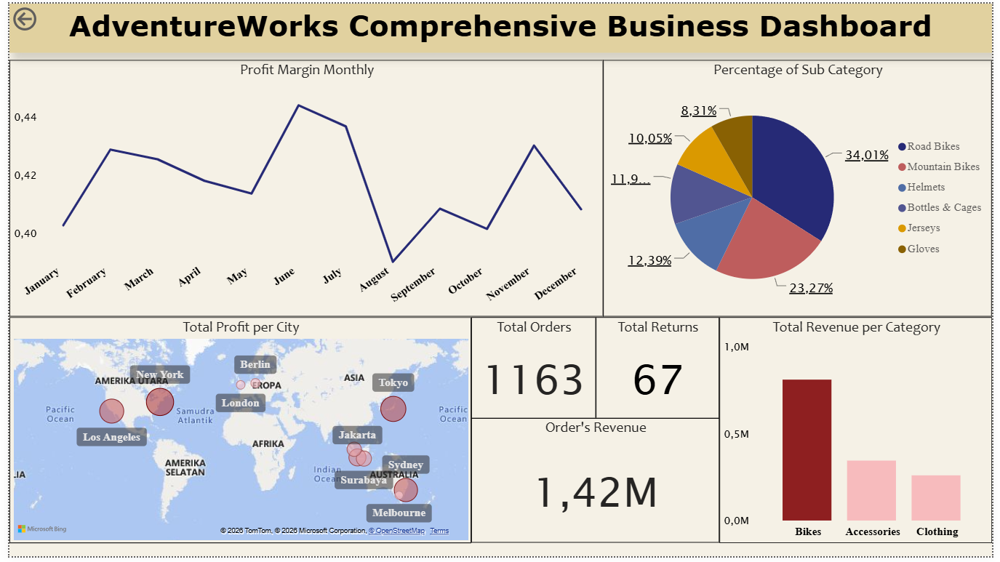

# 📊 AdventureWorks Business Dashboard

Power BI dashboard developed using the AdventureWorks dataset to analyze sales performance, profitability, customer behavior, and geographic trends.

---

## 📌 Project Overview

This dashboard transforms raw sales data into actionable business insights through interactive visualizations and key performance indicators (KPIs).

---

## 🎯 Business Objectives

- Monitor business performance
- Analyze product profitability
- Identify top-performing cities
- Track monthly profit margin
- Understand sales distribution by product category

---

## 🛠 Tools Used

- Power BI
- DAX
- SQL
- Excel

---

## 📂 Dataset

Microsoft AdventureWorks Sales Dataset

---

## 📸 Dashboard Preview

---

## 📈 Dashboard Features

- KPI Cards
- Monthly Profit Margin Trend
- Revenue by Category
- Profit by City
- Product Category Analysis
- Returns Monitoring

---

## 💡 Key Insights

- Total Revenue: 1.42M
- Total Orders: 1,163
- Total Returns: 67
- Road Bikes contributed the largest share of sales.
- Profit margin reached its highest level in June.
